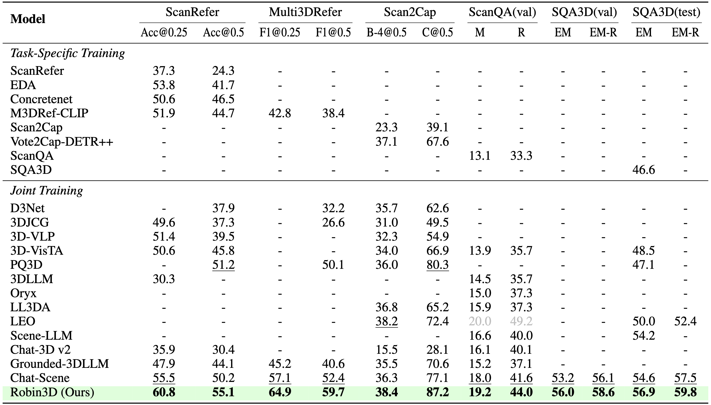

# Robin3D: Improving 3D Large Language Model via Robust Instruction Tuning

We present Robin3D, a state-of-the-art 3D Large Language Model trained on large-scale instruction-following data generated by our novel Robust Instruction Generation (RIG) data engine. To handle our RIG-generated complex data, our Robin3D further enhances its spatial understanding by Relation-Augmented Projector and improves the object referring and grounding ability by ID-Feature Bonding.

## News

**[2024.09]** We release Robin3D [[paper](https://arxiv.org/pdf/2410.00255)][[code](https://github.com/WeitaiKang/Robin3D)], a new SOTA 3D LLM for 3D scenes.

## 🔥 Robin3D vs Previous Methods



## 🔨 Preparation

- Prepare the environment:
  
  ```shell
  conda create -n robin3d python=3.9.17
  conda activate robin3d
  conda install pytorch==2.2.1 torchvision==0.17.1 torchaudio==2.2.1 pytorch-cuda=11.8 -c pytorch -c nvidia
  pip install -r requirements.txt
  ```
  
- Download LLM backbone:
  -  We use Vicuna-7B v1.5 in our experiments, which can be downloaded from [Hugging Face](https://huggingface.co/lmsys/vicuna-7b-v1.5).

- Annotations and extracted features:
  
  Please follow the instructions in [Chat-Scene's Preparation](https://github.com/ZzZZCHS/Chat-Scene/tree/dev/preprocess).


## 🤖 Training and Inference

- Coming soon.
  

## 📄 Citation

Our paper has disappeared from Google Scholar, and we don't know why. We have emailed the Google Scholar team but have not received a response yet.

If you find our work useful in your research, please consider citing:
```
@misc{kang2025robin3dimproving3dlarge,
      title={Robin3D: Improving 3D Large Language Model via Robust Instruction Tuning}, 
      author={Weitai Kang and Haifeng Huang and Yuzhang Shang and Mubarak Shah and Yan Yan},
      year={2025},
      eprint={2410.00255},
      archivePrefix={arXiv},
      primaryClass={cs.AI},
      url={https://arxiv.org/abs/2410.00255}, 
}
```

Stay tuned for our project. 🔥

If you have any questions or suggestions, feel free to drop us an email (`k13711752197@gmail.com`) or open an issue.

## 😊 Acknowledgement

Thanks to the open source of the following projects:

LLMs:
[LLaMA](https://github.com/facebookresearch/llama), 
[Vicuna](https://github.com/lm-sys/FastChat),

3D Datasets:
[ScanNet](https://github.com/ScanNet/ScanNet), 
[ScanRefer](https://github.com/daveredrum/ScanRefer), 
[ReferIt3D](https://github.com/referit3d/referit3d), 
[Scan2Cap](https://github.com/daveredrum/Scan2Cap), 
[ScanQA](https://github.com/ATR-DBI/ScanQA), 
[SQA3D](https://github.com/SilongYong/SQA3D), 
[Multi3dRefer](https://github.com/3dlg-hcvc/M3DRef-CLIP),
[Grounded-3DLLM](https://github.com/OpenRobotLab/Grounded_3D-LLM),
[Chat-Scene](https://github.com/ZzZZCHS/Chat-Scene/tree/dev)

Detectors:
[Mask3D](https://github.com/JonasSchult/Mask3D),

Representations:
[Uni3D](https://github.com/baaivision/Uni3D),
[DINOv2](https://github.com/facebookresearch/dinov2)

3D Models:
[OpenScene](https://github.com/pengsongyou/openscene)
